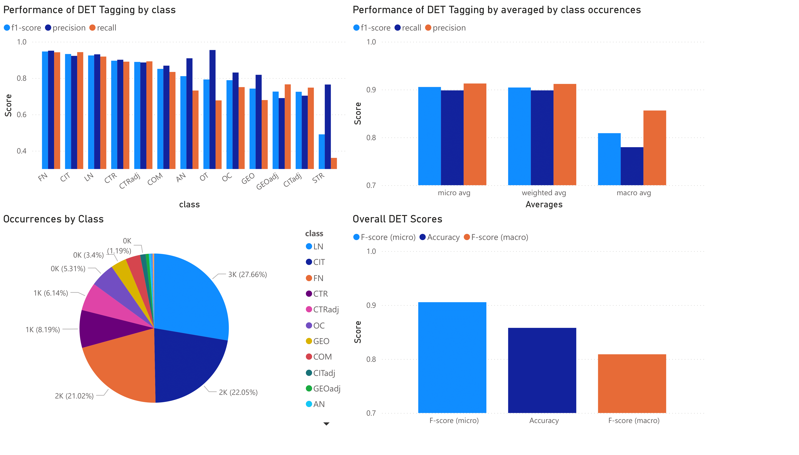
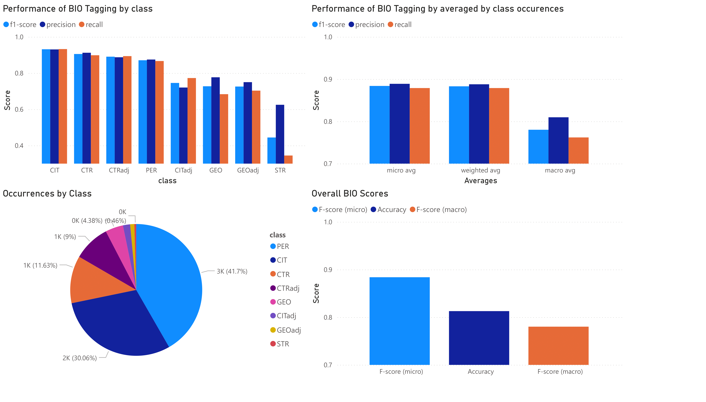

Ground-Truth Data
=================
We have ground-truth data for each component of this pipeline.

OCR
---
The OCR ground-truth can be downloaded here [1] and was created according to the following principles:

* By reading order, not by order of appearance on the page.
* Everything is transcribed as written, except for dashes that denote a word was split over the end of a paragraph. These use special (¬) symbols.
* Pictures of handwritten texts are not transcribed.

The calculated character error rate (CER) results from comparing this ground-truth to the currently online ABBYY FineReader output on E-Periodica.

===================  =======  =====
Magazine-Year-Issue  Pages    CER
===================  =======  =====
cmt-1998_076         50-69    7.71%
edu-1897_033         175-194  2.51%
fsi-1930_000         105-124  5.40%
gfr-1901_056         305-324  1.52%
hvg-1960_059         78-97    1.08%
obl-2004_000         1-20     2.41%
rep-1896_008         409-428  7.48%
tjb-1955_030         45-64    1.99%
woh-1982_057         1-20     2.23%
zut-2019_139         206-225  0.90%
===================  =======  =====

Regarding the unusually high CER for cmt and rep: Both are French magazines, and ABBYY FineReader incorrectly removes all é, à, è, and ç characters. Moreover, it did not correctly set the apostrophes for words such as "c'est", instead opting for "c est". On the other hand, fsi simply has many ads where the reading order and characters are more difficult to determine.

[1] https://polybox.ethz.ch/index.php/s/kQdNd4ao38gYBAK

Tagging
-------
Tagging with FlairNLP was evaluated using a different set of pages than linking and OCR. We tagged using DET and BIO tagging, which are later combined for aggregation and linking. The ground-truth for these pages is available here [2]. The figures below show the occurrences of the different classes as well as their performance.

[2] https://polybox.ethz.ch/index.php/s/F9K5brYiTPZdEqc

Linking
-------
The linking ground-truth was created based on the ABBYY FineReader OCR output, so we evaluate end-to-end. For completeness, you can find the performance of our system on our ground-truth OCR below.

* A True Positive refers to the correct GND-ID being present in the top-k of the candidate GNDs for an aggregated person entity.
* A False Positive refers to the case where no ground-truth GND-ID exists, yet our system assigned one.
* A False Negative refers to the case where the ground-truth GND-ID was not in the top-k candidate list.

The "level" can be either "entity" or "reference". An entity is an aggregated person entity, for which we have a list of where in this magazine this person entity appeared, down to the position on the page. A reference is each such position. The idea is that we "weigh" entities more that also appear more often, the reasoning being that if they are referenced more, we must have more information on them and thus should be able to link them accurately. Thus to us, only the reference level is of interest, but we present the entity level as well in order to more easily compare our system to others, or even old versions of our system.

+-----------------------------------------------+
| k = 1, end-to-end                             |
+-----+-----+---+---+---+---------+-------+-----+
|level| tp  |fp |fn |tn |precision|recall |f1   |
+=====+=====+===+===+===+=========+=======+=====+
|ent  |125  |158|42 |346|0.442    |0.749  |0.556|
+-----+-----+---+---+---+---------+-------+-----+
|ref  |872  |637|369|920|0.578    |0.703  |0.634|
+-----+-----+---+---+---+---------+-------+-----+

+-----------------------------------------------+
| k = 3, end-to-end                             |
+-----+-----+---+---+---+---------+-------+-----+
|level| tp  |fp |fn |tn |precision|recall |f1   |
+=====+=====+===+===+===+=========+=======+=====+
|ent  |136  |147|42 |346|0.481    |0.764  |0.59 |
+-----+-----+---+---+---+---------+-------+-----+
|ref  |913  |596|328|920|0.605    |0.736  |0.664|
+-----+-----+---+---+---+---------+-------+-----+

The JSON files for our manually linked ground-truth data can be downloaded here [3]. Note that the "GT" only refers to the linking part—we took the tagging output of our system unchanged in order to generate the linking ground-truth (hence, end-to-end). If the OCR, tagging, or aggregation improves, naturally the linking will improve as well.

[3] https://huggingface.co/datasets/rashiti-g/eperiodica-chnobli

If we consider disambiguation only (InKB - in knowledge-base) as the GERBIL platform does, we end up with a Macro-F1 score of 0.749 for top-1, ref-fuzzy and 0.767 for top-1, ent-fuzzy. Since NIL mentions are a significant portion of our dataset, this score was of no interest to us and is only reported here for completeness.